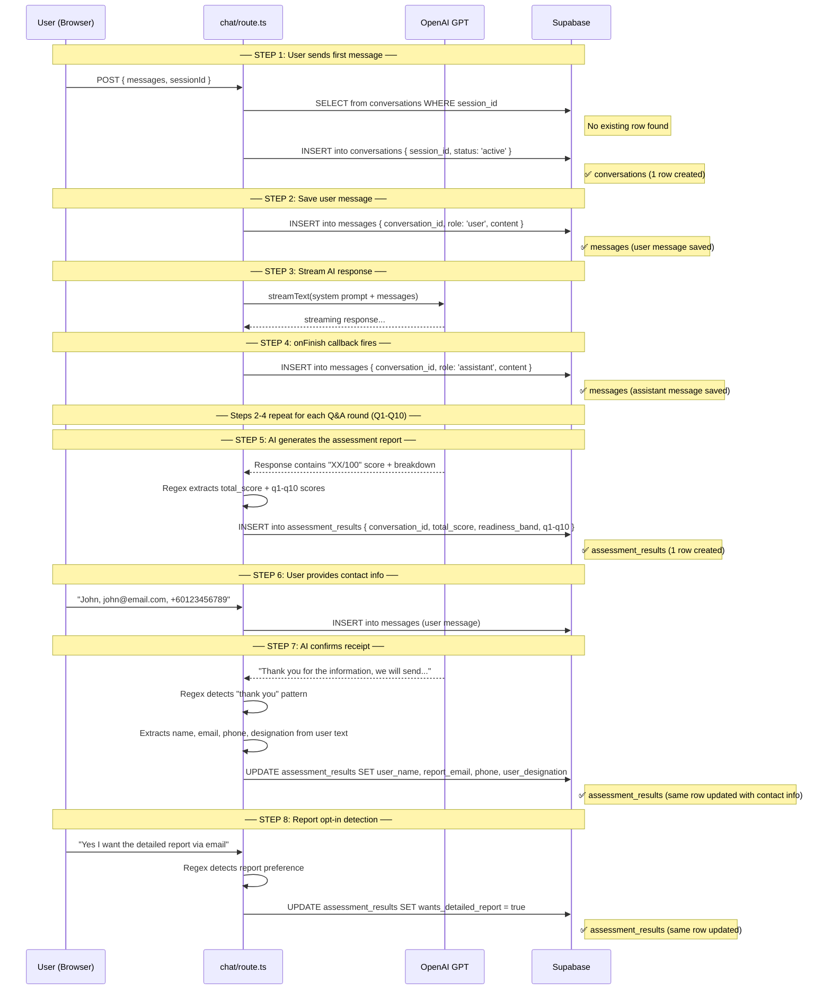

# Database Storage Flow — EECA Assessment

All database writes happen in [chat/route.ts](file:///c:/Source%20Code/AI%20chatbot/src/app/api/chat/route.ts) during the `POST` handler.

---

## Step-by-Step Flow



---

## Summary: What Gets Written Where

### `conversations` — 1 row per session
| When | Code Line | What |
|------|-----------|------|
| First message | [L90-109](file:///c:/Source%20Code/AI%20chatbot/src/app/api/chat/route.ts#L90-L109) | `session_id`, `status: 'active'`, `page_url` |

### `messages` — N rows per session (audit log)
| When | Code Line | What |
|------|-----------|------|
| Every user message | [L128-134](file:///c:/Source%20Code/AI%20chatbot/src/app/api/chat/route.ts#L128-L134) | `role: 'user'`, raw text |
| Every AI response | [L188-192](file:///c:/Source%20Code/AI%20chatbot/src/app/api/chat/route.ts#L188-L192) | `role: 'assistant'`, raw text |

### `assessment_results` — 1 row per assessment (3 writes to same row)
| When | Code Line | What |
|------|-----------|------|
| AI shows score report | [L237-251](file:///c:/Source%20Code/AI%20chatbot/src/app/api/chat/route.ts#L237-L251) | **INSERT** — `total_score`, `readiness_band`, `q1-q10_score` |
| User gives contact info | [L293-305](file:///c:/Source%20Code/AI%20chatbot/src/app/api/chat/route.ts#L293-L305) | **UPDATE** — `user_name`, `report_email`, `phone`, `user_designation` |
| User opts in/out of report | [L146-149](file:///c:/Source%20Code/AI%20chatbot/src/app/api/chat/route.ts#L146-L149) | **UPDATE** — `wants_detailed_report` |

---

## Final State: 1 Assessment = 3 Tables

```
conversations     → 1 row   (session metadata)
messages          → ~22 rows (10 user + 10 assistant + extras — raw audit log)
assessment_results → 1 row   (all structured data in one place)
```

> [!NOTE]
> `messages` is NOT a duplicate of `assessment_results`. It stores the **full conversation text** used by the report generator to produce AI analysis. `assessment_results` stores **structured, extracted fields** for the dashboard and report template.
