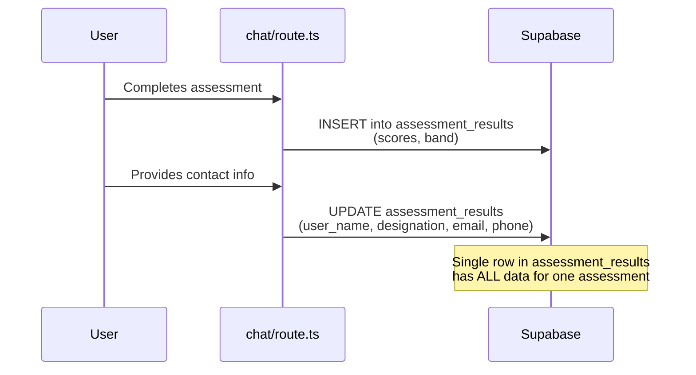

# Duplicate Storage Fix Plan

## Problem Summary

For **one assessment**, data is being stored **redundantly across two tables**:

| Data | `assessment_results` | `contact_submissions` | Redundant? |
|------|:---:|:---:|:---:|
| `name` | ✅ `user_name` | ✅ `name` | **Yes** |
| `email` | ✅ `report_email` | ✅ `email` | **Yes** |
| `phone` | ❌ | ✅ `phone` | No (only in contacts) |
| `designation` | ✅ `user_designation` | ❌ | No (only in results) |
| `conversation_id` | ✅ | ✅ | **Yes** |

### How It Happens

In [chat/route.ts](file:///c:/Source%20Code/AI%20chatbot/src/app/api/chat/route.ts), inside the `onFinish` callback (lines 263–318), when the AI detects the user submitted their contact info:

1. **Line 297** — Inserts into `contact_submissions` with `name`, `email`, `phone`
2. **Lines 305–312** — Updates `assessment_results` with `user_name`, `user_designation`, `report_email`

Both writes happen in the **same code block**, for the **same user**, in the **same conversation**.

Additionally, `contact_submissions` can also be written to from the **separate** [contact/route.ts](file:///c:/Source%20Code/AI%20chatbot/src/app/api/contact/route.ts) API — but in the current EECA flow, this route isn't called by the chatbot; contact info is extracted inline by the chat route.

---

## Root Cause

The `contact_submissions` table was originally designed as a **generic lead-capture table** (with fields like `company`, `message`). When `assessment_results` was added later, user identity fields (`user_name`, `report_email`, `user_designation`) were added directly to that table to support report generation. But the original `contact_submissions` insert was never removed — creating the duplication.

---

## Fix Plan

### Option A: Remove `contact_submissions` insert from chat route ✅ Recommended

Since **all needed user data** already lives in `assessment_results` (name, email, designation), and the dashboard/report only reads from `assessment_results`:

**Changes:**

1. **`src/app/api/chat/route.ts`** (lines 296–302)  
   - **Remove** the `contact_submissions.insert(...)` block
   - **Keep** the `assessment_results.update(...)` block (lines 305–312)
   - **Add** `phone` to the `assessment_results` update (currently lost)

2. **`supabase/schema.sql`** — Add `phone` column to `assessment_results`:
   ```sql
   ALTER TABLE public.assessment_results ADD COLUMN phone TEXT;
   ```

3. **`supabase/migration.sql`** — Add migration for `phone` column

4. **`src/app/api/contact/route.ts`** — **Keep as-is**  
   This is a standalone API for any future general contact form (not part of the assessment flow), so it stays.

5. **Dashboard** — No changes needed (already reads from `assessment_results`)

### Option B: Remove user fields from `assessment_results`, JOIN at query time

Move `user_name`, `user_designation`, `report_email` out of `assessment_results` and always JOIN with `contact_submissions` when needed.

> [!WARNING]
> This is **not recommended** because:
> - `contact_submissions` doesn't have `designation` — would need a schema change anyway
> - The report/dashboard queries would need JOIN logic everywhere
> - More complex for no real benefit

---

## Affected Files (Option A)

| File | Change |
|------|--------|
| [chat/route.ts](file:///c:/Source%20Code/AI%20chatbot/src/app/api/chat/route.ts#L296-L302) | Remove `contact_submissions.insert` from assessment flow |
| [schema.sql](file:///c:/Source%20Code/AI%20chatbot/supabase/schema.sql#L49-L72) | Add `phone TEXT` column to `assessment_results` |
| [migration.sql](file:///c:/Source%20Code/AI%20chatbot/supabase/migration.sql) | Add `ALTER TABLE` for `phone` column |

> [!NOTE]
> The `contact_submissions` **table itself** stays — it serves `contact/route.ts` which is a separate, general-purpose contact API. We're only removing the **redundant insert** from the chat assessment flow.

---

## Data Flow After Fix


