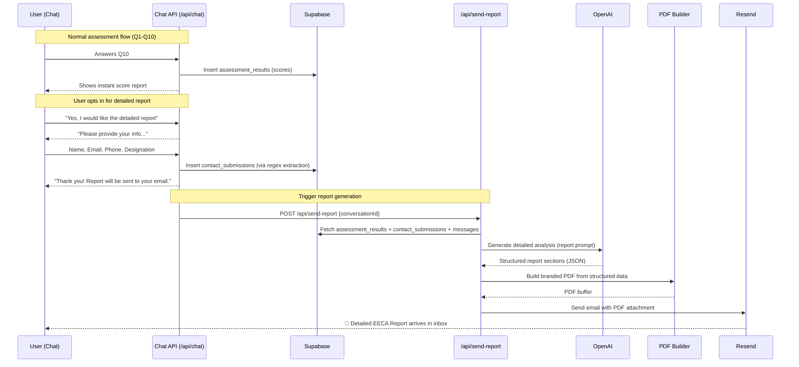

# Option C — AI-Generated Report: Detailed Implementation Plan

## Overview

When a user finishes the assessment and opts in for the detailed report, the system will:
1. Collect their contact info (already happens via in-chat Step 7b)
2. Pull their structured scores from the database
3. Call OpenAI with a **report-specific prompt** to generate a personalized, detailed analysis
4. Build a branded PDF from the AI output
5. Email the PDF to the user via Resend

The entire flow is **automatic** — no manual "2 working days" needed.

---

## Architecture



---

## What Gets Built (File Map)

| File | Action | Purpose |
|---|---|---|
| `src/lib/ai/report-prompt.ts` | **New** | System prompt for the detailed report AI call |
| `src/lib/report/generate-report.ts` | **New** | Orchestrator: fetch data → AI call → build PDF → send email |
| `src/lib/report/build-pdf.ts` | **New** | Server-side PDF builder with Sandhurst branding |
| `src/lib/report/send-email.ts` | **New** | Resend email sender with branded HTML template |
| `src/app/api/send-report/route.ts` | **New** | API route that triggers report generation |
| `src/app/api/chat/route.ts` | **Modify** | Add trigger to call `/api/send-report` after contact info extraction |
| `src/lib/pdf/generate-report.ts` | **Keep** | Existing client-side PDF for instant "Download PDF" button |
| `src/components/chat/message-bubble.tsx` | **Modify** | Uncomment the "Download PDF" button on score messages |

---

## Phase 1: Report Prompt (`src/lib/ai/report-prompt.ts`)

This is the key differentiator. Instead of parsing markdown from the chat, we make a **dedicated AI call** with structured input data and ask for structured output.

### Input to AI
```typescript
interface ReportInput {
  userName: string;
  userDesignation: string;
  totalScore: number;
  readinessBand: 'High' | 'Moderate' | 'Low' | 'Critical';
  scores: {
    q1: number; q2: number; q3: number; q4: number; q5: number;
    q6: number; q7: number; q8: number; q9: number; q10: number;
  };
  // The actual user answers extracted from chat messages
  userAnswers: {
    question: string;
    answer: string;
  }[];
}
```

### Output from AI (Structured JSON via `generateObject`)
```typescript
interface ReportOutput {
  executiveSummary: string;           // 2-3 paragraphs overview
  scoreBreakdown: {
    question: string;
    userAnswer: string;
    score: number;
    maxScore: number;
    explanation: string;              // Why this score, what it means
    recommendation: string;           // Specific action for this area
  }[];
  gapAnalysis: {
    area: string;
    severity: 'Critical' | 'High' | 'Medium' | 'Low';
    finding: string;
    regulation: string;              // Specific EECA regulation reference
    risk: string;                    // What happens if not addressed
  }[];
  actionPlan: {
    priority: number;
    action: string;
    timeline: string;                // "Within 3 months", "Within 1 year"
    regulatoryBasis: string;         // EECA regulation number
    responsible: string;             // "Energy Manager", "Management", etc.
  }[];
  complianceSummary: {
    criterion: string;
    status: 'Compliant' | 'Partial' | 'Non-Compliant' | 'Unknown';
    detail: string;
  }[];
}
```

### Prompt Design
The report prompt will:
- Receive the structured scores + user answers as context
- Reference the full EECA Regulations 2024 (same legal text from the chat prompt)
- Be instructed to produce a **professional advisory report** suitable for Sandhurst Advisory's clients
- Generate regulation-specific recommendations (e.g., "Regulation 4 requires REM appointment within 3 months of notice")
- Use `generateObject` with a Zod schema to guarantee structured output — no regex parsing

> [!IMPORTANT]
> Using `generateObject` (structured output) instead of `generateText` means we get **guaranteed JSON conforming to our schema**. This eliminates all the fragile regex parsing that plagues the current approach.

---

## Phase 2: PDF Builder (`src/lib/report/build-pdf.ts`)

### Library Choice: `jspdf` + `jspdf-autotable` (server-side)

**Why not switch libraries?**
- `jspdf` is already installed and familiar
- Adding `jspdf-autotable` gives proper table rendering
- Runs server-side in the API route (no browser needed)
- Avoids the heavy weight of `puppeteer` (~300MB) in Docker

### PDF Structure (8-10 pages)

```
┌─────────────────────────────────────┐
│  PAGE 1 — COVER                     │
│  ┌─────────────────────────────┐    │
│  │  Sandhurst Advisory Logo    │    │
│  │  ───────────────────────    │    │
│  │  EECA Compliance &          │    │
│  │  Readiness Assessment       │    │
│  │  DETAILED REPORT            │    │
│  │                             │    │
│  │  Prepared for: [Name]       │    │
│  │  Designation: [Title]       │    │
│  │  Date: [Date]               │    │
│  │                             │    │
│  │  ┌───────────────────────┐  │    │
│  │  │  READINESS SCORE      │  │    │
│  │  │      72 / 100         │  │    │
│  │  │  Moderate Readiness   │  │    │
│  │  └───────────────────────┘  │    │
│  └─────────────────────────────┘    │
├─────────────────────────────────────┤
│  PAGE 2 — EXECUTIVE SUMMARY        │
│  AI-generated overview of findings  │
│  and key recommendations            │
├─────────────────────────────────────┤
│  PAGE 3-4 — SCORE BREAKDOWN        │
│  Table: Q1-Q10 with score,         │
│  explanation, and recommendation    │
├─────────────────────────────────────┤
│  PAGE 5-6 — GAP ANALYSIS           │
│  Prioritized gaps with severity,    │
│  EECA regulation references,        │
│  and risk statements                │
├─────────────────────────────────────┤
│  PAGE 7-8 — ACTION PLAN            │
│  Numbered actions with timelines,   │
│  regulatory basis, and responsible  │
│  parties                            │
├─────────────────────────────────────┤
│  PAGE 9 — EECA COMPLIANCE SUMMARY  │
│  Traffic-light table: Compliant /   │
│  Partial / Non-Compliant per area   │
├─────────────────────────────────────┤
│  PAGE 10 — ABOUT & CONTACT         │
│  Sandhurst Advisory info            │
│  Enerlytic Intelligence branding    │
│  Disclaimer & confidentiality       │
└─────────────────────────────────────┘
```

### Branding
- **Header**: Navy bar (`#001d39`) with Sandhurst logo (embedded as base64)
- **Accent color**: Green (`#4CAF50`) for highlights, score badges
- **Typography**: Helvetica (built into jsPDF)
- **Footer**: Every page — "Sandhurst Advisory × Enerlytic Intelligence | Confidential" + page numbers
- **Score badge**: Color-coded by band (Green=High, Yellow=Moderate, Orange=Low, Red=Critical)

---

## Phase 3: Email Delivery (`src/lib/report/send-email.ts`)

### Resend Setup
```
RESEND_API_KEY=re_xxxxxxxxxxxx          # Add to .env.local
RESEND_FROM_EMAIL=reports@sandhurstadvisory.com.my  # Verified domain
```

### Email Structure
- **From**: `EECA Assessment <reports@sandhurstadvisory.com.my>`
- **Subject**: `Your EECA Compliance & Readiness Assessment Report`
- **Body**: Branded HTML email with:
  - Sandhurst logo
  - Score summary (number + band)
  - 3 key findings preview
  - "See attached PDF for the full report"
  - Contact information for follow-up
- **Attachment**: The generated PDF (`EECA_Assessment_Report_[Name]_[Date].pdf`)

---

## Phase 4: Wiring It Together

### 4a. API Route (`src/app/api/send-report/route.ts`)

```
POST /api/send-report
Body: { conversationId: string }

Flow:
1. Validate conversationId
2. Fetch assessment_results from Supabase
3. Fetch contact_submissions for this conversation
4. Fetch messages to extract user answers
5. Call generateReport() orchestrator
6. Return { success: true } or { error: string }
```

### 4b. Auto-Trigger from Chat Route

In [route.ts](file:///c:/Source%20Code/AI%20chatbot/src/app/api/chat/route.ts) at **line 186-222** (the contact extraction block), after successfully saving the contact submission:

```typescript
// After contact is saved, trigger report generation in background
// Uses fire-and-forget so it doesn't block the chat response
fetch(`${process.env.NEXT_PUBLIC_APP_URL || 'http://localhost:3000'}/api/send-report`, {
  method: 'POST',
  headers: { 'Content-Type': 'application/json' },
  body: JSON.stringify({ conversationId }),
}).catch(err => console.warn('Report trigger failed:', err));
```

> [!TIP]
> The report is triggered **automatically** when the AI detects the "thank you for the information" pattern and contact info is extracted. The user doesn't need to click anything — they just see the confirmation in chat, and the email arrives shortly after.

### 4c. Uncomment Download PDF Button

In [message-bubble.tsx](file:///c:/Source%20Code/AI%20chatbot/src/components/chat/message-bubble.tsx), uncomment the `showReportActions` block (lines 209-244) but **only keep the PDF download button** — remove the email input since email is now automatic.

---

## Phase 5: Database Enhancement

### Update `assessment_results` table to store report status

```sql
ALTER TABLE public.assessment_results
  ADD COLUMN report_status TEXT DEFAULT 'pending'
    CHECK (report_status IN ('pending', 'generating', 'sent', 'failed')),
  ADD COLUMN report_sent_at TIMESTAMPTZ,
  ADD COLUMN report_email TEXT;
```

This lets us:
- Track which assessments have received reports
- Avoid duplicate sends
- Show status in the admin dashboard

---

## New Dependencies

| Package | Purpose | Size Impact |
|---|---|---|
| `jspdf-autotable` | Proper table rendering in PDF | ~50KB |
| *(none others)* | `resend`, `jspdf`, `openai`, `zod` already installed | — |

> [!NOTE]
> Only **one new package** needed. Everything else is already in the project.

---

## Implementation Order

| Step | What | Estimated Effort | Depends On |
|---|---|---|---|
| **1** | `report-prompt.ts` — Write the report generation prompt + Zod schema | ~1 hour | Nothing |
| **2** | `send-email.ts` — Resend email sender with HTML template | ~30 min | Resend API key |
| **3** | `build-pdf.ts` — Server-side PDF builder with branding | ~2 hours | Step 1 schema |
| **4** | `generate-report.ts` — Orchestrator (fetch → AI → PDF → email) | ~1 hour | Steps 1-3 |
| **5** | `send-report/route.ts` — API route | ~30 min | Step 4 |
| **6** | Modify `chat/route.ts` — Auto-trigger after contact extraction | ~15 min | Step 5 |
| **7** | Modify `message-bubble.tsx` — Uncomment PDF download button | ~15 min | Nothing |
| **8** | DB migration — Add report tracking columns | ~10 min | Nothing |
| **9** | Test end-to-end | ~1 hour | Steps 1-8 |

**Total: ~6-7 hours of work**

---

## Risk Mitigation

| Risk | Mitigation |
|---|---|
| AI generates inconsistent report quality | Zod schema enforces structure; prompt includes few-shot examples |
| OpenAI API fails during report generation | Retry with backoff (reuse existing `withRetry`); set `report_status = 'failed'`; admin can re-trigger |
| Resend email delivery fails | Log failure; admin dashboard shows `report_status`; manual resend option |
| PDF generation fails in Docker | `jspdf` is pure JS — no native dependencies, works everywhere |
| User provides invalid email in chat | Regex extraction already validates format; Resend also validates |
| Duplicate report sends | Check `report_status` before generating — skip if already `'sent'` |

---

## Configuration Required Before Starting

| # | Item | Status |
|---|---|---|
| 1 | **Resend API key** — Sign up at resend.com, get API key | ⬜ Needed |
| 2 | **Verified sender domain** — Add `sandhurstadvisory.com.my` DNS records in Resend | ⬜ Needed |
| 3 | **Sandhurst logo as base64** — For embedding in PDF without file system dependency | ⬜ Needed |
| 4 | **`RESEND_API_KEY`** added to `.env.local` | ⬜ Needed |
| 5 | **`RESEND_FROM_EMAIL`** added to `.env.local` | ⬜ Needed |

> [!WARNING]
> **Resend requires domain verification** to send from a custom email. Without it, you can only send from `onboarding@resend.dev` (fine for testing). You'll need DNS access to `sandhurstadvisory.com.my` to add the verification records.
